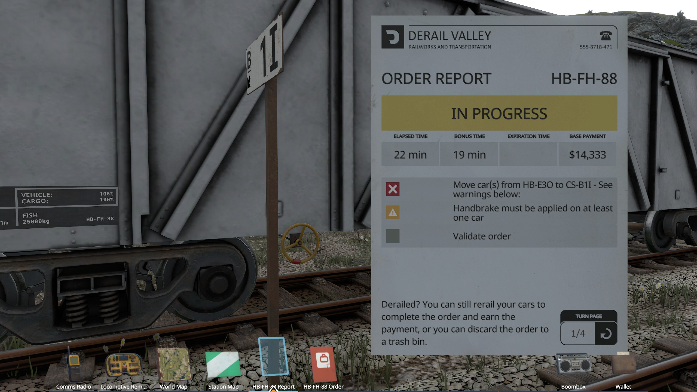
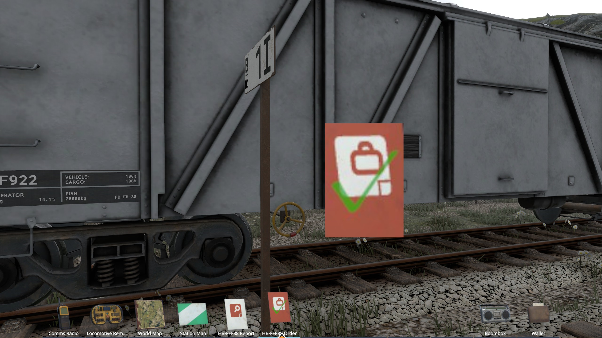

# DvMod.Paperwork
A quality-of-life mod for Derail Valley that enhances job paperwork management.

## Features

### Completed Job Checkmark
Job booklet inventory icons are automatically marked with a checkmark overlay when all tasks for that job are completed.

| Incomplete | Complete |
|---|---|
|  |  |

### Automatic Paperwork on Board
When boarding a train, or coupling to additional cars, the corresponding job booklets are automatically added to your inventory so you always have your paperwork on hand.

## License
MIT